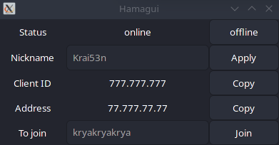

<h2 align="center">
	Hamagui is <a style="text-decoration:none" href="https://www.vpn.net">Hamachi</a>  gui interface.
</h2>

#

#

	This is not an official product by LogMeIn Inc.

### Why it is exist?
I have some problems when start [Hamachi](https://www.vpn.net). I have problems with other alternatives for Gnu/Linux too. Only Cli from [Hamachi](https://www.vpn.net) worked fine but process of using it a harder then just GUI apps. So, I decided write wrapper of Hamachi Cli.

### How to use it?
Work in progress
